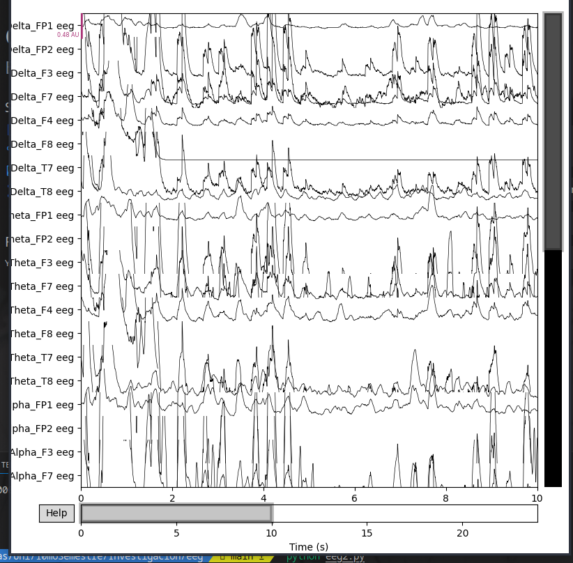

# Instalación de Python y Configuración de Entorno Virtual

Este repositorio contiene un proyecto que requiere Python y algunas dependencias específicas. Siga estos pasos para configurar el entorno de desarrollo adecuado.

## 1. Instalación de Python

Si aún no tiene Python instalado, siga estos pasos:

### Windows

1. Descargue el instalador de Python desde el sitio web oficial: [Descargar Python](https://www.python.org/downloads/).
2. Ejecute el instalador y asegúrese de marcar la casilla "Agregar Python x.x al PATH" durante la instalación.

### Linux

La mayoría de las distribuciones de Linux ya incluyen Python. Para verificar si está instalado, ejecute el siguiente comando en la terminal:

```bash
python3 --version
```

Si no está instalado, puede usar el administrador de paquetes de su distribución para instalarlo.

### macOS

macOS generalmente viene con Python preinstalado. Para verificar la versión de Python instalada, ejecute el siguiente comando en la terminal:

```bash
python3 --version
```

## 2. Configuración de Entorno Virtual

Se recomienda crear un entorno virtual para este proyecto para evitar conflictos entre las dependencias de otros proyectos. Siga estos pasos:

1. Abra una terminal.

2. Instale la herramienta `virtualenv` si aún no está instalada:

   ```bash
   pip install virtualenv
   ```

3. Navegue hasta la carpeta de su proyecto:

   ```bash
   cd /ruta/a/tu/proyecto
   ```

4. Cree un entorno virtual:

   ```bash
   virtualenv venv
   ```

5. Active el entorno virtual:

   - En Windows:

     ```bash
     venv\Scripts\activate
     ```

   - En Linux/macOS:

     ```bash
     source venv/bin/activate
     ```

## 3. Instalación de Dependencias

Este proyecto utiliza un archivo `requirements.txt` para enumerar sus dependencias. Para instalarlas, ejecute el siguiente comando desde la raíz de su proyecto (asegúrese de que su entorno virtual esté activado):

```bash
pip install -r requirements.txt
```

¡Listo! Ahora su entorno está configurado y todas las dependencias están instaladas. Puede comenzar a trabajar en su proyecto.

## Uso

Describe aquí cómo utilizar tu proyecto, por ejemplo, cómo ejecutarlo o cómo importar las bibliotecas en tu código.



## Contribución

Si desea contribuir a este proyecto, siga las pautas de contribución en el archivo CONTRIBUTING.md.

## Problemas

Si encuentra algún problema o tiene alguna pregunta, por favor, abra un problema en el repositorio.
